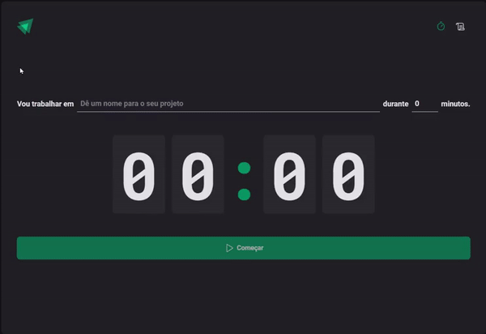

# Problem to solve

A timer that would help me control time to focus on work tasks. Pomodoro-style timer for controlling focus on activities

## Technologies and libraries

- ReactJs with Typescript
- Styled Component
- React Router Dom
- Context API
- Reducers
- Immer - Helper to work with immutability in a simpler way;
- React Hook Form, para criação de formulários controlled e uncontrolled inputs;
- Zod e hookform/resolvers para validação dos inputs;

## Demo

[Try to use](https://ageurdo.github.io/timer-to-do/) 

